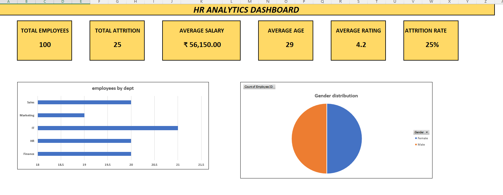
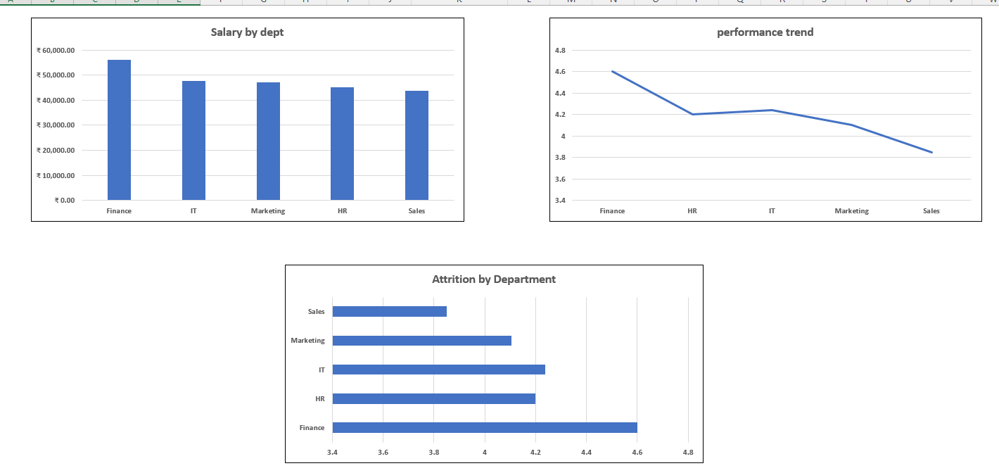

# HR Analytics Dashboard (Excel)

## Dashboard Preview

## 📌 Project Overview

This project is an HR Analytics Dashboard created using Microsoft Excel...# HR Analytics Dashboard (Excel)

## 📌 Project Overview
This project is an HR Analytics Dashboard created using Microsoft Excel. It provides insights into employee data through KPIs, Pivot Tables, Pivot Charts, and Slicers.

The dashboard helps analyze workforce distribution, attrition, salary trends, and employee performance across different departments.

---

## 📊 Features

- Total Employees KPI
- Total Attrition KPI
- Average Salary
- Average Age
- Attrition Rate Analysis
- Department-wise Employee Count
- Gender Distribution
- Average Salary by Department
- Performance Rating Analysis
- Interactive Slicers for filtering dashboard data

---

## 🛠 Tools Used

- Microsoft Excel
- Pivot Tables
- Pivot Charts
- Slicers
- Excel Formulas (COUNTIF, COUNTA, AVERAGE)
- Dashboard Design

---

## 📂 File Structure

- Raw Data
- HR Data
- Pivot Tables & Charts
- Dashboard

---

## 📈 Dashboard Insights

- Employee distribution by department
- Gender-wise employee count
- Average salary comparison
- Department-wise attrition
- Performance analysis
- Overall HR KPIs

---

## 🎯 Skills Demonstrated

- Data Cleaning
- Data Analysis
- Dashboard Creation
- Pivot Table Analysis
- Data Visualization
- HR Analytics
- Excel Reporting

---

This project was created for learning and portfolio purposes to demonstrate Excel-based HR Analytics and Dashboard development skills.
